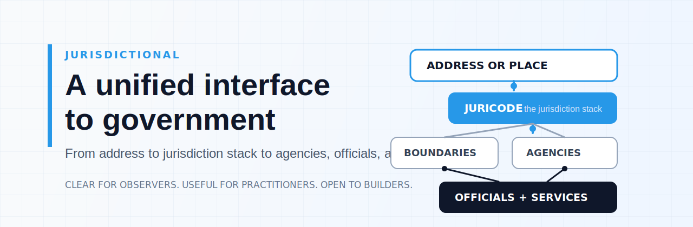
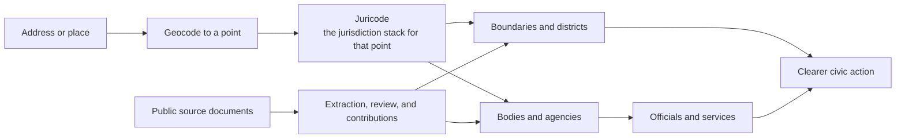

  

# A Unified Interface to Government

Jurisdictional maps the stack of public institutions that governs a place, then connects that stack to the bodies, agencies, officials, and services people actually need to see.

It is designed to be useful at different depths: for people getting oriented, for practitioners doing real civic work, and for builders creating tools on top of open civic infrastructure.

## What Jurisdictional Does

**A Juricode** is the full stack of jurisdictions that governs a specific point on the map, from local to federal.

## Start Here

<table>
  <tr>
    <td valign="top" width="33%">
      <strong>Understand</strong> 
      Start with the repositories and docs to see how place, boundary, institution, and service fit together.
    </td>
    <td valign="top" width="33%">
      <strong>Apply</strong> 
      Use the demos, data model, and public artifacts to orient real work in a specific place.
    </td>
    <td valign="top" width="33%">
      <strong>Build</strong> 
      Follow the active repositories and contribute code, research, design, or civic data.
    </td>
  </tr>
</table>

## Why It Exists

Government is legible only in fragments for most people. Jurisdictional treats the edges between jurisdictions as part of the core model, not as an afterthought.

The goal is clearer coordination across places, rules, and institutions.

We care about work that is clear enough for institutions, flexible enough for local realities, and open enough for collaboration.

[Browse repositories](https://github.com/jurisdictional?tab=repositories)
